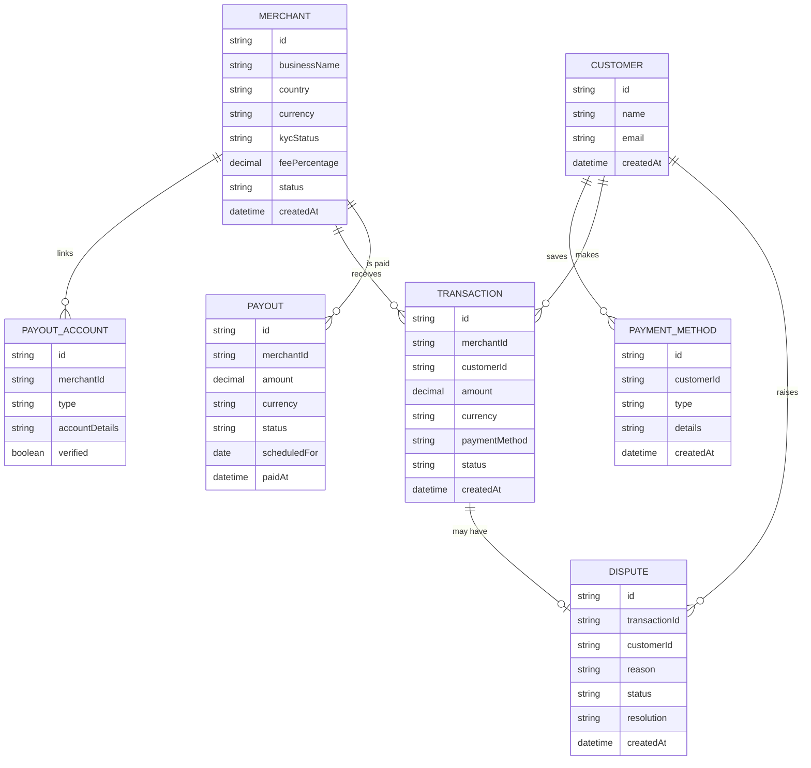

# Domain Model

The platform's data centers on a Merchant's onboarding, the Transactions their customers pay, and the Payouts settled back to them; Disputes and saved Payment Methods hang off those.

- **Merchant** — a registered business; `kycStatus` tracks onboarding review, `feePercentage` the flat rate applied to its transactions.
- **PayoutAccount** — the bank or mobile wallet a Merchant's weekly payout is sent to.
- **Transaction** — one customer payment via mobile money or card; `customerId` is optional (guest checkout).
- **Payout** — one scheduled weekly settlement run's disbursement to a Merchant.
- **Dispute** — a Customer's challenge to a Transaction, mediated by a Platform Admin.
- **Customer** — a shopper with an optional account for saved Payment Methods and history.

