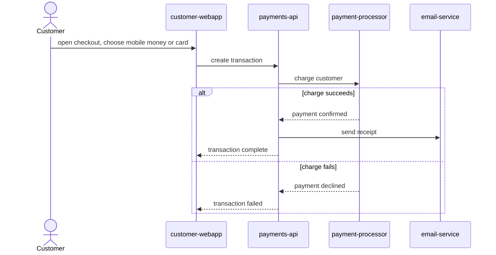

# Customer Checkout

A Customer pays a Merchant through the hosted checkout; the platform charges via the payment processor and confirms by email.

```mermaid
sequenceDiagram
    actor Customer
    participant customerwebapp as customer-webapp
    participant api as payments-api
    participant processor as payment-processor
    participant email as email-service

    Customer->>customerwebapp: open checkout, choose mobile money or card
    customerwebapp->>api: create transaction
    api->>processor: charge customer
    alt charge succeeds
        processor-->>api: payment confirmed
        api->>email: send receipt
        api-->>customerwebapp: transaction complete
    else charge fails
        processor-->>api: payment declined
        api-->>customerwebapp: transaction failed
    end
```

