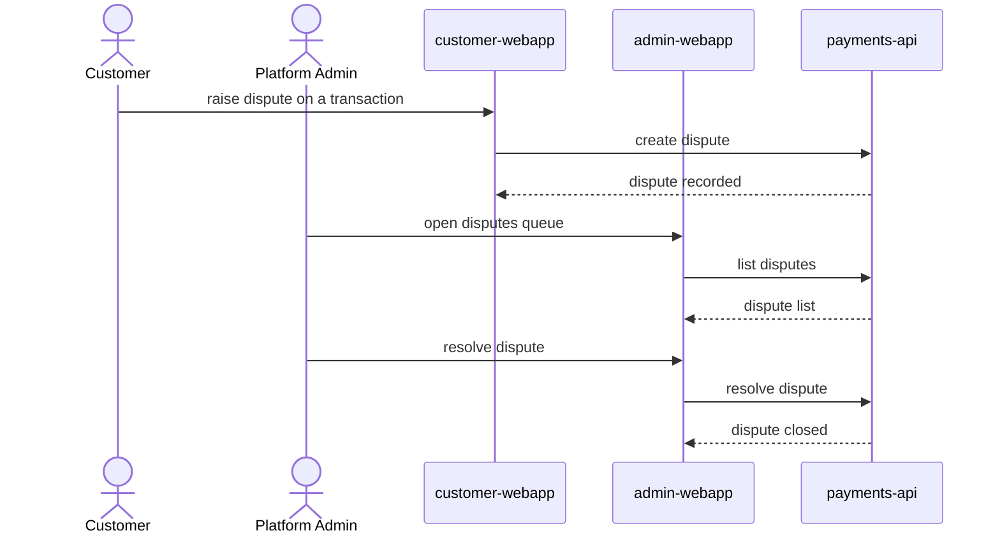

# Dispute Resolution

A Customer raises a dispute on a transaction; a Platform Admin mediates the outcome with the Merchant.

```mermaid
sequenceDiagram
    actor Customer
    actor Admin as Platform Admin
    participant customerwebapp as customer-webapp
    participant adminwebapp as admin-webapp
    participant api as payments-api

    Customer->>customerwebapp: raise dispute on a transaction
    customerwebapp->>api: create dispute
    api-->>customerwebapp: dispute recorded
    Admin->>adminwebapp: open disputes queue
    adminwebapp->>api: list disputes
    api-->>adminwebapp: dispute list
    Admin->>adminwebapp: resolve dispute
    adminwebapp->>api: resolve dispute
    api-->>adminwebapp: dispute closed
```

