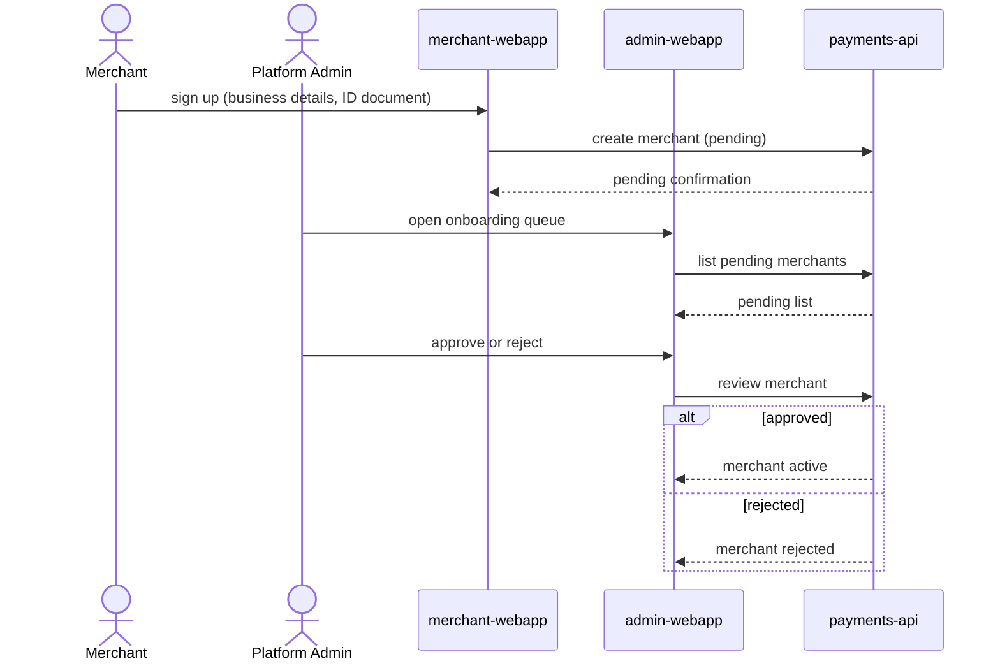

# Merchant Onboarding

A Merchant registers and completes KYC; a Platform Admin reviews and activates the account before it can collect payments.

```mermaid
sequenceDiagram
    actor Merchant
    actor Admin as Platform Admin
    participant merchantwebapp as merchant-webapp
    participant adminwebapp as admin-webapp
    participant api as payments-api

    Merchant->>merchantwebapp: sign up (business details, ID document)
    merchantwebapp->>api: create merchant (pending)
    api-->>merchantwebapp: pending confirmation
    Admin->>adminwebapp: open onboarding queue
    adminwebapp->>api: list pending merchants
    api-->>adminwebapp: pending list
    Admin->>adminwebapp: approve or reject
    adminwebapp->>api: review merchant
    alt approved
        api-->>adminwebapp: merchant active
    else rejected
        api-->>adminwebapp: merchant rejected
    end
```

