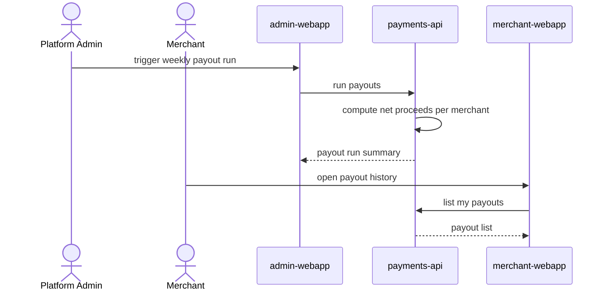

# Weekly Payout Run

A Platform Admin triggers the weekly payout run; the platform nets fees and disburses to each Merchant's linked payout account.

```mermaid
sequenceDiagram
    actor Admin as Platform Admin
    actor Merchant
    participant adminwebapp as admin-webapp
    participant api as payments-api
    participant merchantwebapp as merchant-webapp

    Admin->>adminwebapp: trigger weekly payout run
    adminwebapp->>api: run payouts
    api->>api: compute net proceeds per merchant
    api-->>adminwebapp: payout run summary
    Merchant->>merchantwebapp: open payout history
    merchantwebapp->>api: list my payouts
    api-->>merchantwebapp: payout list
```

